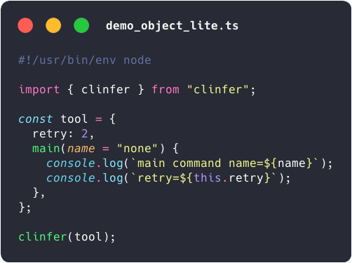
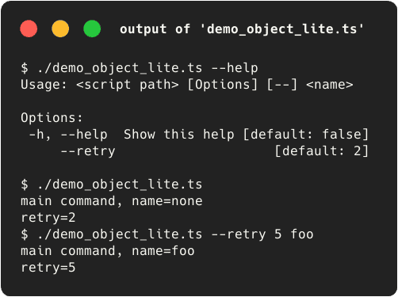
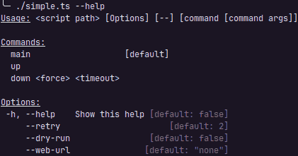

<p align="center" dir="auto">
  <a href="https://jersou.github.io/clinfer/" rel="nofollow">
    
  </a>
  <br/>
<b>clinfer JS (CLI infer-ence) : auto generate CLIs from code</b>
  <br/>
  <a href="https://npmjs.org/package/clinfer" rel="nofollow"></a>
  <a href="https://jsr.io/@jersou/clinfer" rel="nofollow"></a>
  <a href="https://jsr.io/@jersou/clinfer" rel="nofollow"></a>
  <a href="https://github.com/jersou/clinfer" rel="nofollow"></a>
  <a href="https://jsr.io/@std" rel="nofollow"></a>
</p>

clinfer brings **CLI** **infer**-ence to Node, Deno, and Bun. Pass it an object,
a class, an ES module or a function, and watch it build your interface
automatically:

- Each field/property generates a CLI option (flag).
- Each method/function generates a CLI command (with parameters as positional
  arguments).

Simply write your tool as a standard JS object, class or ES module, and hand it
over to clinfer. It will automatically parse the command-line arguments, map
them to your code, execute the right methods, and handle the help menu. You can
then easily customize the generated help, add aliases, and fine-tune your CLI.

## Overview : example with an object

<table>
  <tr valign="top">
    <td></td>
    <td></td>
  </tr>
</table>

## Quick start

Install clinfer with :

- `npm install clinfer`
- or with Deno : `deno add clinfer` or `deno add jsr:@jersou/clinfer`

Import clinfer function : `import { clinfer } from "clinfer";`

Init a script :

```javascript
#!/usr/bin/env node
import { clinfer } from "clinfer";

const tool = {
  retry: 2,
  main(name = "none") {
    console.log(`main command name=${name}`);
    console.log(`retry=${this.retry}`);
  },
};

clinfer(tool);
```

The first line, the shebang, allows you to launch the script directly. The
generated CLI :

```
Usage: <script path> [Options] [--] <name>

Options:
 -h, --help  Show this help [default: false]
     --retry                    [default: 2]
```

## Features

- No API to learn to build a basic CLI—just create a standard object.
- You can then expand the object to optionally specify helpers, aliases, types,
  and more.
- No need to define a separate type or schema for your CLI parameters; your
  input code is the schema.
- Nest multiple objects to compose a complex CLI with multi-level commands, each
  with its own options.
- Built-in support for JSON configuration files to manage options.
- The help is generated automatically:<br/>
  

<!-- Plain text (without color and styles in markdown):
$ ./simple.ts --help
Usage: <script path> [Options] [--] [command [cmd args]]

Commands:
  main                   [default]
  up
  down <force> <timeout>

Options:
 -h, --help    Show this help [default: false]
     --retry                      [default: 2]
     --dry-run                [default: false]
     --web-url               [default: "none"]
-->

- Run the commands with options and arguments

```shell-session
#             ↓↓↓↓↓↓↓↓↓↓↓↓↓ options ↓↓↓↓↓↓↓↓↓↓↓↓  ↓ command ↓  ↓ cmd args ↓
$ ./simple.ts --dry-run --web-url=tttt --retry 4     down        true  14
down command { force: true, timeout: 14 } Tool { retry: 4, dryRun: true, webUrl: 'tttt' }

$ ./simple.ts down true 14                     #  ↓↓↓  default options from class init  ↓↓↓
down command { force: true, timeout: 14 } Tool { retry: 2, dryRun: false, webUrl: 'none' }

$ ./simple.ts --dry-run --webUrl=tttt # ← same case of the field name works too : --webUrl or --web-url
main command Tool { retry: 2, dryRun: true, webUrl: 'tttt' } # ← main is the default command
```

## Documentation

**The full documentation of clinfer is here :
[jersou.github.io/clinfer/](https://jersou.github.io/clinfer/#/README).**

- [Getting started](README.md)
- Usage
  - [clinfer() usage](clinfer-usage.md)
  - [clinfer inputs](clinfer-input.md)
  - [Options parsing](CLI-usage.md)
- Configuration
  - [Customization](customization.md)
  - [ClinferRunConfig](configuration.md)
- [Dev notes](dev-notes.md)
- [Changelog](CHANGELOG.md)
