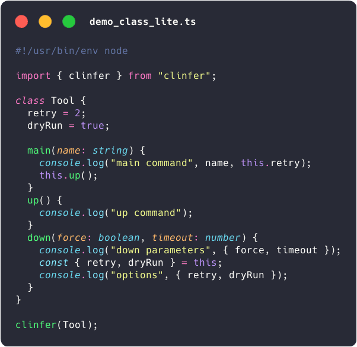
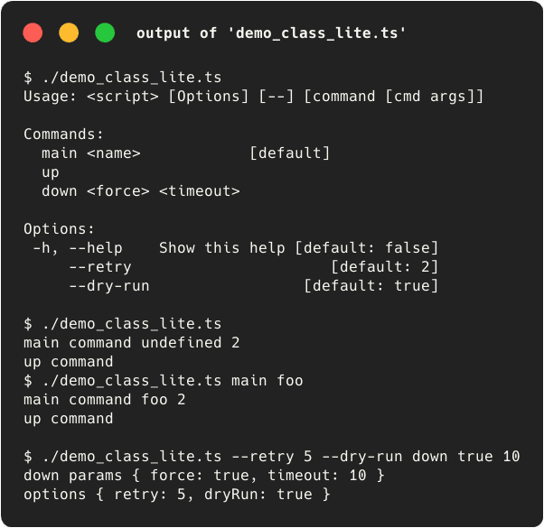
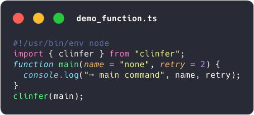
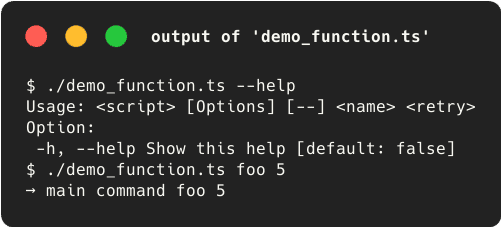
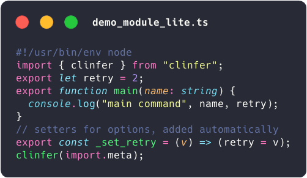
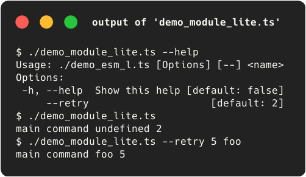
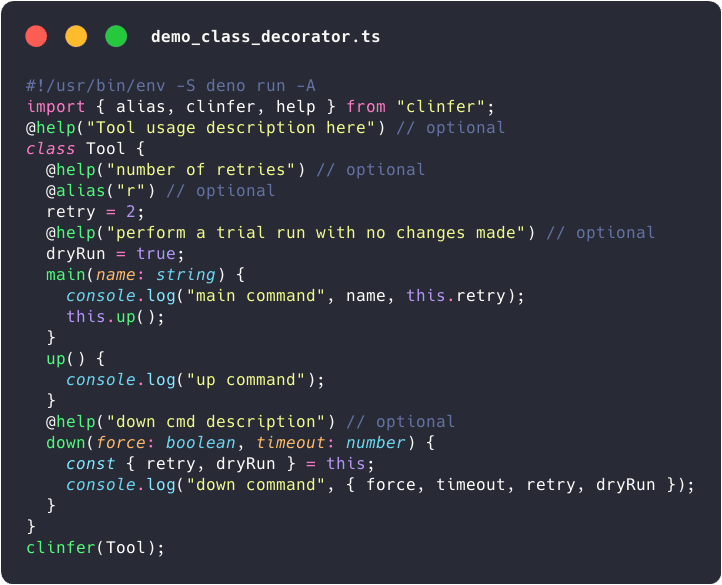
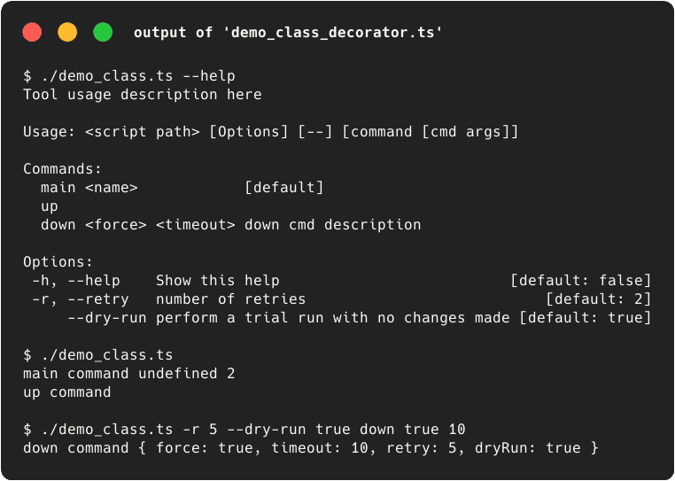
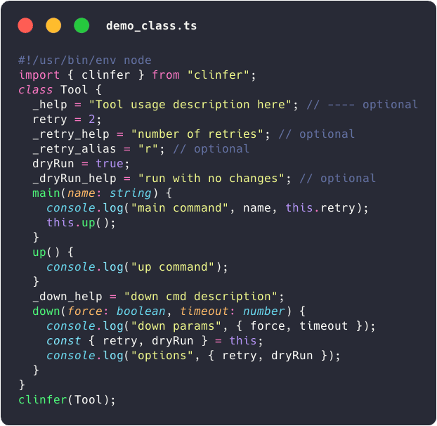
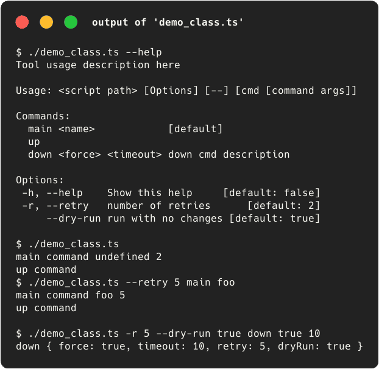

Several examples can be found in the [examples/](./examples) folder.

### Example with a class

<table>
  <tr valign="top">
    <td></td>
    <td></td>
  </tr>
</table>

### Example with a function

<table>
  <tr valign="top">
    <td></td>
    <td></td>
  </tr>
</table>

### Example with a module (ESM)

<table>
  <tr valign="top">
    <td></td>
    <td></td>
  </tr>
</table>

### Full example with decorators (Typescript, Deno)

Works with vanilla TypeScript or with experimentalDecorators = true

<table>
  <tr>
    <td></td>
    <td></td>
  </tr>
</table>

### Full example without decorator (Javascript)

<table>
  <tr>
    <td></td>
    <td></td>
  </tr>
</table>

### Plain Object

A plain JS Object can be used :

```typescript
import { clinfer } from "clinfer";

clinfer({
  retry: 2,
  main() {
    console.log("main command", this);
  },
  _up_help: "create and start the services",
  up(svc: string, timeout = 10) {
    console.log("up command", { svc, timeout, retry: this.retry });
  },
  down(svc: string) {
    console.log("down command", { svc, retry: this.retry });
  },
});
```

```shell-session
$ ./plain_object_lite.ts --retry=77 up foo 123 up command { svc: "foo", timeout:
123, retry: 77 }

$ ./plain_object_lite.ts --help
Usage: <script path> [Options] [--] [command [cmd args]]

Commands:
  main               [default]
  up <svc> <timeout>
  down <svc>

Options:
 -h, --help  Show this help [default: false]
     --retry                    [default: 2]
```

### Function

A function can be used :

```typescript
import { clinfer } from "clinfer";

function down(force = false, timeout = 5) {
  console.log("down command", { force, timeout });
}

clinfer(down);
```

```shell-session
$ ./examples/example-function.ts true 100
down command { force: true, timeout: 100 }

$ ./examples/example-function.ts --help
Usage: <script path> [Options] [--] <force> <timeout>

Option:
  -h, --help Show this help [default: false]
```

### Generate a CLI with ES modules

Example from [examples/example-module.ts](examples/module.ts) or
[examples/node-npm/simple/example-module.mjs](./examples/node-npm/simple/example-module.mjs)
(**NodeJs**).

Generate a CLI with `clinfer(import.meta)` : exported functions are available as
commands.

```typescript
import { clinfer } from "clinfer";

export function up() {
  private_function();
  console.log("up command");
}

function private_function() {
  console.log("private_function");
}

export function down(force = false, timeout = 5) {
  console.log("down command", { force, timeout });
}

export const main = () => console.log("main");

clinfer(import.meta);
```

```shell-session
$ ./examples/module-lite.ts down true 100
down command { force: true, timeout: 100 }

./examples/module-lite.ts --help
Usage: <Object file> [Options] [--] [command [cmd args]]

Commands:
  down <force> <timeout>
  main                   [default]
  up

Option:
  -h, --help Show this help [default: false]
```

Due to ESM security limitations (exported variables are read only in the
import), the var/let variables are exposed as CLI options only if they are
exported and if there is a "_set_<name>" function that allows their
modification.

clinfer suggests adding it automatically at first run :

```
This module contains exported variables without 'clinfer' setters : opt.
It's necessary for clinfer to process options (= exported var/let) due to ESM security limitations.
You must append these lines to "example-module.ts" :
    export const _set_opt = (v: typeof opt) => (opt = v);
Do you want me to append this lines at the end of "example-module.ts" now ? [Y/n]
```

Example with an option setter :

```typescript
import { clinfer } from "clinfer";

export let opt = "foo";
// To allow the modification of opt from the CLI
export const _set_opt = (v: typeof opt) => (opt = v);

export function up() {
  private_function();
  console.log("up command", opt);
}

function private_function() {
  console.log("private_function");
}

down._help = "down custom help";
export function down(force = false, timeout = 5) {
  console.log("down command", { force, timeout, opt });
}

export const main = () => console.log("main", opt);

clinfer(import.meta);
```

```shell-session
$ ./examples/example-module.ts --opt bar down true 100
down command { force: true, timeout: 100, opt: "bar" }

$ ./examples/example-module.ts --help
Usage: <Object file> [Options] [--] [command [cmd args]]

Commands:
  down <force> <timeout> down custom help
  main                   [default]
  up

Options:
 -h, --help Show this help [default: false]
     --opt                 [default: "foo"]
```

⚠️ warning : do not use await on `clinfer(import.meta)`, doing so will cause a
deadlock, as clinfer awaits the module, which cannot be resolved if you use
`await clinfer(import.meta)`.

Note: clinfer can generate CLI from imported module with `import * as ...` :

```typescript
import { clinfer } from "clinfer";
import * as tool from "./example-module.ts";

clinfer(tool);
```
