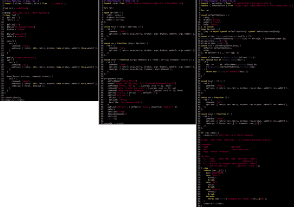
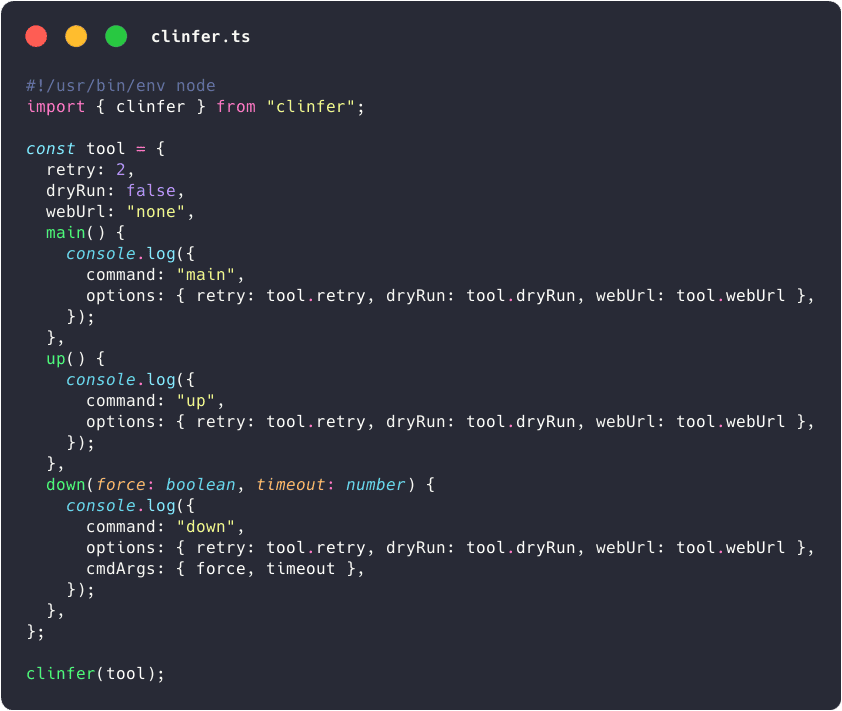
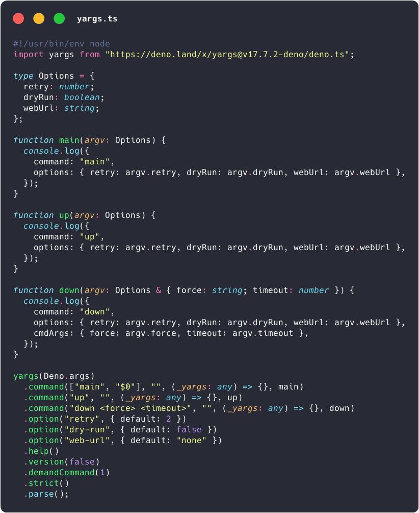
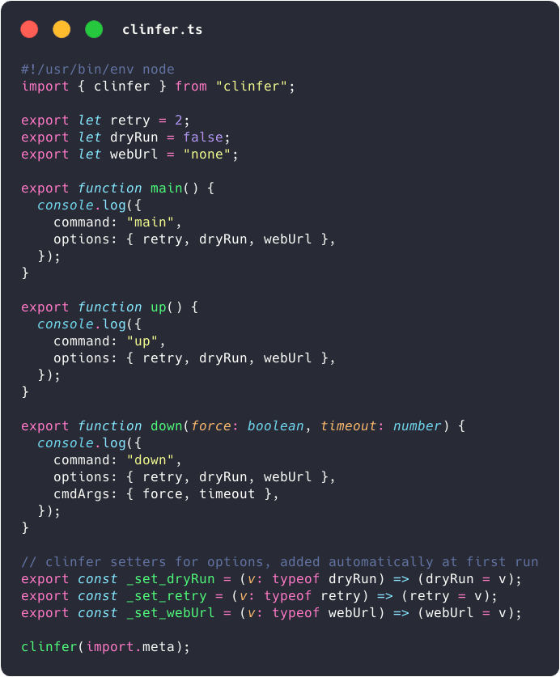

## Dependencies (all)

- `@std/cli` : to parse args
- `@std/fmt` : to log with colors/bold
- `@std/text` : to change the option case
- `@std/assert` : for the tests

## Inspiration

Probably inspired by:

- [Bash-utils](https://github.com/jersou/bash-utils#principes) : run bash
  function from CLI with `utils:run "$@"`, I created 4 years before clinfer,
- and by [Clap](https://github.com/clap-rs/clap) (with the derive feature) after
  the development of [mouse-actions](https://github.com/jersou/mouse-actions)
  (one year before clinfer) : deserialize options from CLI to struct.

Note: I have only recently discovered (May 2026) other projects sharing the same
concept.

- https://github.com/google/python-fire
- https://github.com/fastapi/typer

## Comparison with other tools : Yargs, @std/cli (minimist)

The usual tools rather take a particular configuration of the tool and produce
an output data **without** a defined model. You need to learn their API to
define the interface you want.

**clinfer follows a different approach: it takes the desired model and fills it
according to the command line**. If you want to type the parsing output, you
don't need to do anything else. No duplicate writing for the CLI config and the
parsing output model/type.

And of course, like classic tools, it also generates the help automatically,
detects the non-existent option/order errors, and launches the desired command
with its parameters.

A comparison try is made in the
[examples/cli-tools-diff](examples/cli-tools-diff) folder, it compares :

- clinfer :
  [examples/cli-tools-diff/clinfer.ts](examples/cli-tools-diff/clinfer.ts)
- vs [Yargs](https://github.com/yargs/yargs) :
  [examples/cli-tools-diff/yargs.ts](examples/cli-tools-diff/yargs.ts)
- vs [@std/cli](https://jsr.io/@std/cli/doc/parse-args) based on
  [minimist](https://github.com/minimistjs/minimist) :
  [examples/cli-tools-diff/std-cli.ts](examples/cli-tools-diff/std-cli.ts)

These 3 files provide the same CLI :

```
Usage: <script path> [Options] [--] [command [cmd args]]

Commands:
  main                   [default]
  up                     create and start
  down <force> <timeout>

Options:
 -h, --help    Show this help  [default: false]
 -r, --retry                       [default: 2]
 -n, --dry-run no changes mode [default: false]
     --web-url web url        [default: "none"]
```

The 3 implementations side by side :

[](examples/cli-tools-diff/diff.png)

A simpler comparaison from
[clinfer.ts](examples/cli-tools-diff/object-diff/clinfer.ts) :

<table>
  <tr valign="top">
    <td></td>
    <td></td>
  </tr>
</table>

Another with module from
[examples/cli-tools-diff/esm-diff](examples/cli-tools-diff/esm-diff) :

<table>
  <tr valign="top">
    <td></td>
    <td></td>
  </tr>
</table>

## Links

- https://github.com/jersou/clinfer
- https://www.npmjs.com/package/clinfer
- https://jsr.io/@jersou/clinfer
